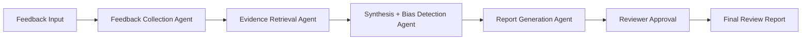

# Bias-Aware 360° Performance Review Intelligence System

[](https://www.python.org/)
[](https://fastapi.tiangolo.com/)
[](https://react.dev/)
[](https://vite.dev/)
[](LICENSE)

## Overview

This project delivers a bias-aware 360° performance review assistant with:

- role-aware reviewer authentication
- evidence-backed synthesis
- bias flag detection
- structured review output
- JSON and PDF reporting
- a polished React dashboard

## Architecture

The backend is a FastAPI service that orchestrates the review workflow, while the frontend is a Vite + React dashboard that provides reviewer controls and exports.

### Core flow



## Features

- Reviewer login with demo roles
- Backend review generation endpoint
- JSON export and PDF generation
- Bias and evidence visibility in the dashboard
- CORS-ready integration for a frontend deployment

## Local setup

### 1. Create and activate the Python environment

```powershell
python -m venv .venv
.venv\Scripts\Activate.ps1
pip install -r requirements.txt
```

### 2. Start the backend

```powershell
.venv\Scripts\python.exe -m uvicorn app.website:app --host 127.0.0.1 --port 8000
```

### 3. Start the frontend

```powershell
cd frontend
npm install
npm run dev -- --host 127.0.0.1 --port 5174
```

### 4. Open the app

- Backend: http://127.0.0.1:8000
- Frontend: http://127.0.0.1:5174

## Demo credentials

- `hr` / `hr123`
- `manager` / `mgr123`
- `reviewer` / `rev123`

## GitHub Pages deployment

The frontend is prepared for a GitHub Pages static deployment.

### Deployment workflow

A GitHub Actions workflow is included in [.github/workflows/deploy-pages.yml](.github/workflows/deploy-pages.yml) to publish the static Vite build to GitHub Pages automatically on pushes to `master`.

### Required repository setting

1. Open the repository on GitHub.
2. Go to Settings → Pages.
3. Set the source to `GitHub Actions`.

### Backend hosting note

GitHub Pages only hosts the static frontend. The FastAPI backend still needs a separate runtime such as Render, Railway, Fly.io, or Azure App Service.

## Production next steps

- replace the in-memory retrieval layer with FAISS or pgvector
- add persistent session storage and a real auth provider
- move the backend to a managed hosting platform
- add release notes and CI checks for lint/build/test automation
