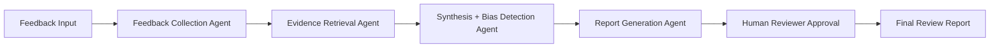

# Bias-Aware 360° Performance Review Intelligence System

## 1. System Architecture

This solution applies a multi-agent workflow to produce a grounded, bias-aware performance review using retrieval-augmented synthesis and a human approval gate.

### Recommended orchestration pattern

Use a LangGraph-style state machine with four specialized agents:

1. Feedback Collection Agent
   - Ingests self-assessment, manager feedback, peer feedback, goals, project outcomes, and meeting notes.
   - Normalizes heterogeneous sources into a review evidence graph.

2. Evidence Retrieval Agent
   - Retrieves the most relevant source fragments for each evaluation claim.
   - Uses semantic retrieval over a vector store and metadata filters, such as role, date, project, and review cycle.

3. Synthesis + Bias Detection Agent
   - Builds structured findings from evidence.
   - Flags recency effects, unsupported claims, stakeholder imbalance, confirmation bias, halo effect, and missing evidence.

4. Report Generation Agent
   - Converts the approved evidence-backed synthesis into a structured performance report.
   - Produces strengths, growth areas, impact highlights, goal progress, and action recommendations.

### End-to-end flow

### Data flow summary

- Raw input is normalized and de-identified to a secure review payload.
- The Evidence Retrieval Agent retrieves supporting snippets with source IDs.
- The Synthesis + Bias Detection Agent produces a structured finding set and bias flags.
- The Report Generation Agent writes the final report only if evidence grounding and approval criteria are satisfied.

## 2. Data Schema

The Python models are defined in [app/models.py](app/models.py).

Key entities:

- FeedbackSource
- FeedbackRecord
- ReviewInput
- BiasFlag
- EvidenceCitation
- ReviewFinding
- PerformanceReviewReport

## 3. Python Boilerplate

The implementation starter is organized as:

- [app/models.py](app/models.py): Pydantic schemas
- [app/agents.py](app/agents.py): Agent logic and orchestration
- [app/main.py](app/main.py): Example entry point

## 4. Governance Strategy

### Privacy and security controls

- Encrypt data at rest and in transit.
- Role-based access control with least privilege.
- Data minimization: retain only the fields needed for review.
- Pseudonymize employee identifiers before retrieval and analysis.
- Apply policy and tagging rules to restrict access by HR, manager, and employee role.

### Auditability

- Log every input, evidence retrieval, bias flag, and human decision.
- Store immutable approval decisions with reviewer identity and timestamp.
- Keep a source traceability index to map every conclusion back to a source record.

### Recommended governance baseline

- DPA and retention policy for employee data
- Consent and purpose limitation controls
- Bias review and equity monitoring of the system itself
- Quarterly red-team testing on bias and privacy failures
